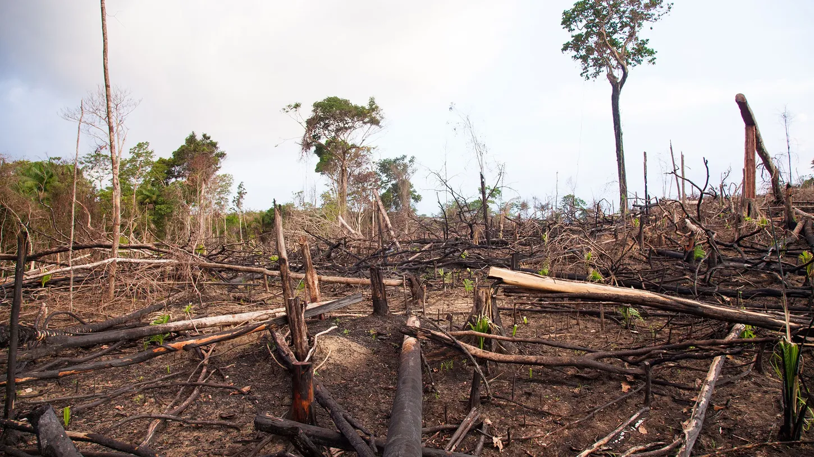
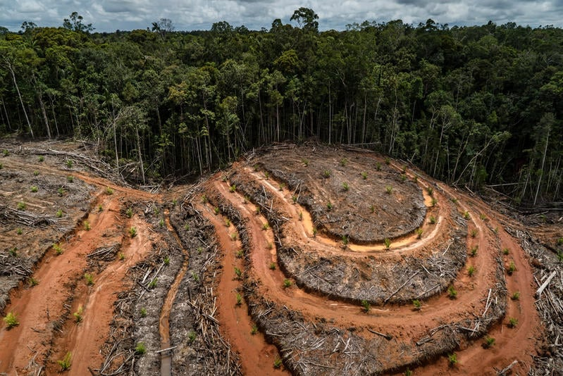
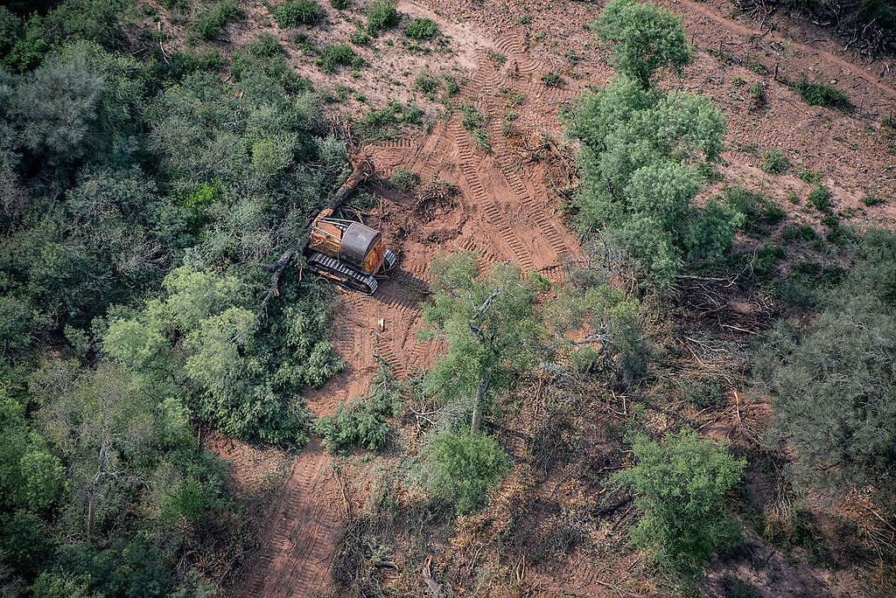

# Deforestacion

# ¿Qué es la deforestación y cómo afecta al medioambiente?

La deforestación es un proceso provocado por el hombre mediante el cual se elimina masa forestal, normalmente con el objetivo de cambiar la actividad a la que se va a dedicar dicho suelo. En algunos países los bosques recuperan terreno, pero en general la tendencia planetaria es eliminarla por actividades como la explotación descontrolada o el crecimiento de la población. La deforestación es incompatible con la especie: los bosques son aliados clave en la lucha contra el cambio climático y la desertificación por su capacidad como sumideros de CO2.

La pérdida de las masas forestales tiene su principal origen en diversas actividades humanas. Ejemplos de ello son desde uso intensivo del suelo para la agricultura y la ganadería a la explotación de minerales en el subsuelo de los bosques, pasando por el aprovechamiento a gran escala de la madera, la especulación del suelo y el crecimiento de la población.

Desde luego puede producirse también por causas naturales. Ejemplo de ello son los cambios climáticos o la desertificación. Sin embargo "éstas tardan mucho más tiempo en eliminar la superficie arbolada”, puntualiza Enrique Segovia, director de Conservación de la organización World Wildlife Fund (WWF) en España.

El protocolo de Kyoto de 1997, al que da continuidad el Acuerdo de París, estableció en uno de sus artículos las especificidades de las actividades vinculadas al uso de la tierra. El objetivo era facilitar el cumplimiento de los compromisos establecidos dentro de ese acuerdo en cuando a reducción de emisiones.

Acuerdo de Kyoto 1997:
- Compromisos de Reducción de Emisiones
- Mecanismos de Flexibilidad
- Contabilización de Sumas y Resta
- Captura y Almacenamiento de Carbono

Acuerdo de Paris:
- Objetivo de temperatura
- Contribuciones Nacionalmente Determinadas (NDCs)
- Neutralidad de carbono
- Financiación climática

# Los árboles como víctimas de la deforestación

Las causas de la deforestación son tan antiguas como la propia actividad humana, especialmente desde la extensión de la agricultura. Algunas zonas del planeta ya sufrieron fases de destrucción del arbolado hace siglos. Los principales motivos son el cambio del uso del suelo para hacerlo cultivable o la tala masiva con el fin de obtener madera. Sin embargo, también afecta mucho el desarrollo industrial intenso unido al crecimiento demográfico.

Este fue el caso de varios países europeos y en Norteamérica. Aunque en la actualidad el proceso se ha invertido en algunos casos y las masas forestales amplían poco a poco su extensión. Tiene mucho que ver una mayor conciencia ecológica de la sociedad respecto a la importancia de los bosques, por ejemplo como sumideros naturales de dióxido de carbono (CO2), fábricas de oxígeno y santuarios de la biodiversidad.

# Doble efecto demográfico en la deforestación

Pero también influyen los aspectos demográficos: el abandono de las zonas rurales y la tendencia a la concentración de la población en las ciudades. Según la ONU, a mediados de siglo vivirá en ellas el 90% de la población global. Enrique Segovia menciona el caso de España: “Es un país que ha tenido una deforestación impresionante durante siglos y ahora está recuperando mucha masa forestal, en parte porque se plantan nuevos bosques y en parte porque los que quedan no se destruyen al despoblar el mundo rural”

## Fuentes

https://www.bbva.com/es/sostenibilidad/que-es-la-deforestacion-y-como-afecta-al-medioambiente/ 

https://www.nationalgeographicla.com/ciencia/2019/11/la-deforestacion-esta-generando-mas-enfermedades-infecciosas-en-los-seres-humanos 

https://www.greenpeace.org/mexico/blog/4074/deforestacion-que-es-quien-la-causa-y-por-que-deberia-importarnos/ 

https://es.wikipedia.org/wiki/Deforestaci%C3%B3n_en_el_Amazonas 

https://infoamazonia.org/es/2023/02/07/la-aceleracion-de-la-deforestacion-en-los-ultimos-meses-de-2022-trae-desafios-a-la-politica-ambiental-del-nuevo-presidente-de-brasil/  
