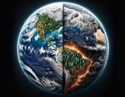
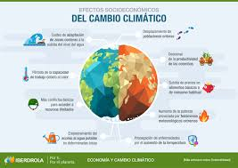
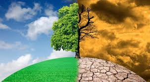

El cambio climático se refiere a los cambios a largo plazo de las temperaturas y los patrones climáticos. Estos cambios pueden ser naturales, debido a variaciones en la actividad solar o erupciones volcánicas grandes. Pero desde el siglo XIX, las actividades humanas han sido el principal motor del cambio climático, debido principalmente a la quema de combustibles fósiles como el carbón, el petróleo y el gas.
# Fosiles
La quema de combustibles fósiles genera emisiones de gases de efecto invernadero que actúan como una manta que envuelve a la Tierra, atrapando el calor del sol y elevando las temperaturas.
- Registro de Paleoclima: Los fósiles proporcionan un registro detallado del clima de la Tierra a lo largo de millones de años, permitiendo a los científicos entender los patrones climáticos pasados y las respuestas de los ecosistemas a los cambios climáticos 

- Evidencia de Cambios Climáticos Pasados: El estudio de fósiles, como los anillos de árboles fósiles, los corales y los sedimentos marinos, revela cómo han variado las temperaturas, los niveles del mar y la concentración de gases de efecto invernadero en el pasado.

- Extinciones Masivas: Los fósiles documentan eventos de extinción masiva vinculados a cambios climáticos abruptos, como la extinción del Pérmico-Triásico, que estuvo asociada con un aumento significativo de las temperaturas y la acidificación oceánica.

- Migración y Adaptación de Especies: Los fósiles muestran cómo las especies han migrado, adaptado o se han extinguido en respuesta a cambios climáticos históricos. Esto ayuda a predecir cómo los organismos modernos podrían responder al cambio climático actual.

# Emisiones
Las emisiones principales de gases de efecto invernadero que provocan el cambio climático son el dióxido de carbono y el metano. Estos proceden del uso de la gasolina para conducir un coche o del carbón para calentar un edificio, por ejemplo. El desmonte de tierras y bosques también puede liberar dióxido de carbono. La agricultura y las actividades relacionadas con el petróleo y el gas son fuentes importante de emisiones de metano. La energía, la industria, el transporte, los edificios, la agricultura y el uso del suelo se encuentran entre los principales emisores.
Somos responsables del calentamiento global

# Historia , presente y futuro.
- Los científicos dedicados a las cuestiones climáticas han demostrado que las personas somos responsables del calentamiento global de los últimos 200 años. Las actividades humanas, tales como las mencionadas arriba, generan gases de efecto invernadero que elevan la temperatura del planeta al ritmo más rápido de los 2000 años pasados.
- La temperatura media de la Tierra es ahora 1,1 °C más elevada que a finales del siglo XIX, antes de la revolución industrial, y más elevada en términos absolutos que en los últimos 100 000 años. La última década (2011-2020) fue la más cálida registrada. En esa línea, cada una de las cuatro décadas útlimas ha sido más caliente que cualquier otra década desde 1850. 

- Mucha gente piensa que el cambio climático significa principalmente temperaturas más cálidas. Pero el aumento de la temperatura es sólo el principio de la historia. Como la Tierra es un sistema, en el que todo está conectado, los cambios de una zona pueden influir en los cambios de todas 
las demás.

# Consecuencias
Las consecuencias del cambio climático incluyen ahora, entre otras, sequías intensas, escasez de agua, incendios graves, aumento del nivel del mar, inundaciones, deshielo de los polos, tormentas catastróficas y disminución de la biodiversidad.

# Nos enfrentamos a un gran reto, pero ya conocemos muchas soluciones.

Muchas soluciones al cambio climático pueden aportar beneficios económicos al tiempo que mejoran nuestras vidas y protegen el medio ambiente. También contamos con marcos y acuerdos globales para guiar el progreso, como los Objetivos de Desarrollo Sostenible, la Convención Marco de las Naciones Unidas sobre el Cambio Climático y el Acuerdo de París. Hay tres amplias categorías de acción: reducir las emisiones, adaptarse a los impactos climáticos y financiar los ajustes necesarios. 

El cambio de los sistemas energéticos de los combustibles fósiles a las energías renovables, como la solar o la eólica, reducirá las emisiones que provocan el cambio climático. Pero tenemos que empezar ya mismo. Aunque una coalición cada vez más numerosa de países se compromete a alcanzar las emisiones cero para 2050, alrededor de la mitad de los recortes en las emisiones deben producirse antes de 2030 para mantener el calentamiento por debajo de 1,5 °C. Este logro requiere grandes reducciones en el uso de carbón, petróleo y gas. Para evitar consecuencias climáticas catastróficas, para antes de 2050, debemos reducir en más de dos tercios la extracción de las reservas actuales confirmadas de combustibles fósiles.

## Fuentes
https://www.un.org/es/climatechange/what-is-climate-change

https://www.argentina.gob.ar/ambiente/cambio-climatico/que-es-el-cambio-climatico

https://es.greenpeace.org/es/trabajamos-en/cambio-climatico/

https://www.cepal.org/es/temas/cambio-climatico/acerca-cambio-climatico

https://www.amnesty.org/es/what-we-do/climate-change/

