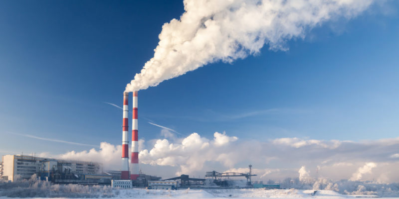
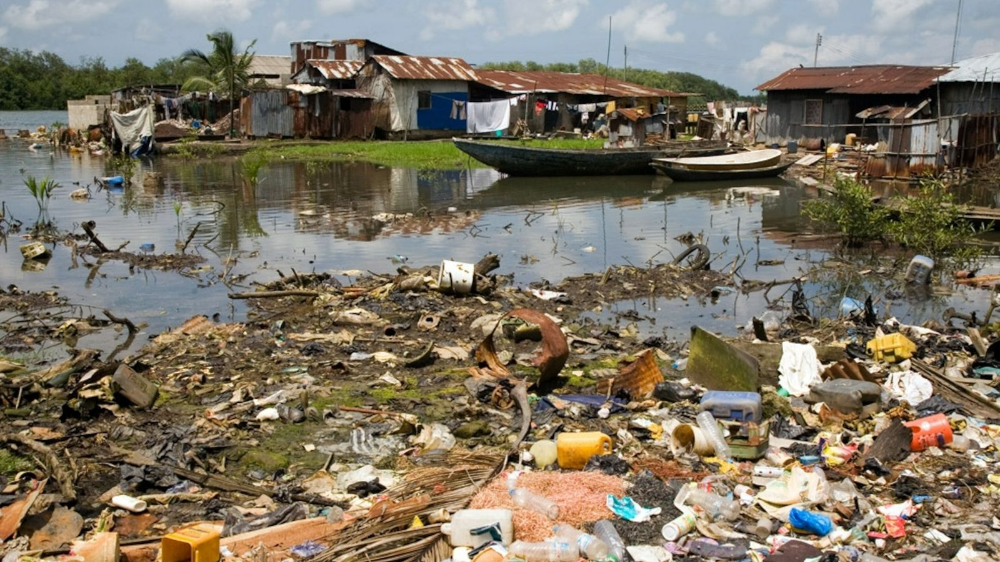
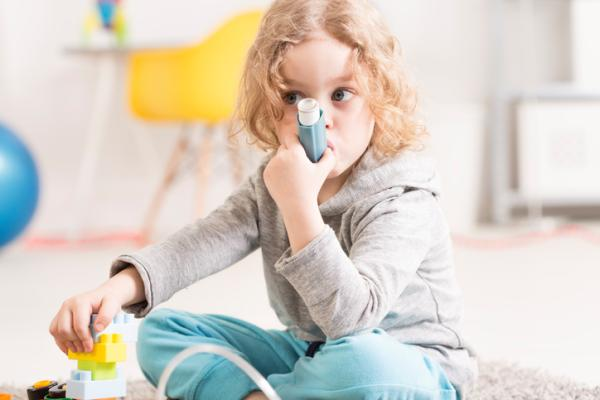
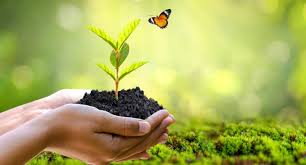

# Contaminación
Se entiende por contaminación ambiental cuando existe la presencia de sustancias nocivas en el agua, aire o suelo. Las sustancias nocivas son lo que llamamos contaminantes ambientales, pudiendo tener diferente origen. Además, se encuentran en diferentes concentraciones y en diferentes lugares.
https://es.wikipedia.org/wiki/Contaminaci%C3%B3n 

# Tipos de contaminación
## Contaminación aerea
La contaminación del aire (tanto el exterior como en de interiores) es la presencia en él de agentes químicos, físicos o biológicos que alteran las características naturales de la atmósfera.
Hay distintos contaminantes:
- Asbesto.
- Contaminantes biológicos.
- Monóxido de carbono (CO)
- Formaldehído.
- Materia particulada en interiores (PM)
- Plomo.
- Moho y humedad.
- Dióxido de nitrógeno (NO2)

https://www.fundacionaquae.org/wiki/causas-y-tipos-de-la-contaminacion-del-aire/ 

## Contaminación de agua
Se define como la acumulación de una o más sustancias ajenas al agua que pueden generar una gran cantidad de consecuencias, entre las que se incluye el desequilibrio en la vida de los seres vivos (animales, plantas y personas).
Los principales contaminantes del agua incluyen bacterias, virus, parásitos, fertilizantes, pesticidas, fármacos, nitratos, fosfatos, plásticos, desechos fecales y hasta sustancias radiactivas. Estos elementos no siempre tiñen el agua, haciendo que la contaminación hídrica resulte invisible en muchas ocasiones.

https://www.iberdrola.com/sostenibilidad/contaminacion-del-agua 

# Problemas de la contaminación
La exposición a altos niveles de contaminación del aire puede causar una variedad de resultados adversos a la salud. La contaminación del aire puede aumentar el riesgo de infecciones respiratorias, enfermedades cardíacas, accidentes cerebrovasculares y cáncer de pulmón.

https://eacnur.org/es/blog/cuales-son-los-problemas-derivados-de-la-contaminacion-tc_alt45664n_o_pstn_o_pst 

# Ideas para solucionarlo
- Utiliza el transporte público.
- Compra productos locales.
- Consume productos ecológicos.
- Recicla.
- Reduce el consumo de plásticos.
- Disminuye el uso del agua y de la energía eléctrica. 
- Elige energías renovables

 

https://www.significados.com/soluciones-contaminacion-ambiental/ 
